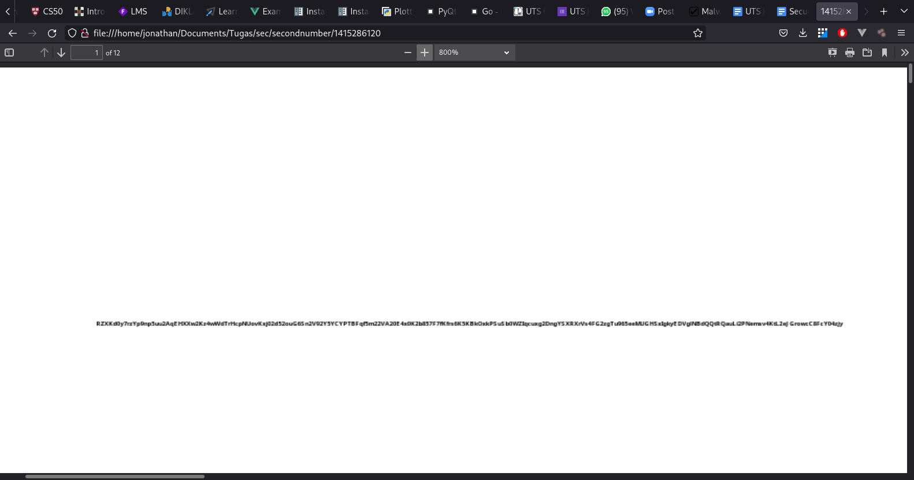

## Traffic Analysis

Dari packet yang pertama dapat dilihat terdapat `source` dan `destination`, disini dapat diambil kesimpulan bahwa kedua IP yaitu  
1. `192.168.204.136` adalah client
2. `192.168.204.2` adalah DNS Server

Adalah *virtual machine*, hal ini dapat dilihat dari frame packet `Ethernet II` pada bagian bawah dimana terdapat **MAC ADDRESSS** yang memiliki kata kunci `VMWare` 

Disini `192.168.204.136` sedang membuka web browser dan mencari sebuah website yaitu `www.magmedia.com.au`, dari frame packet yang ada dapat diketahui `182.160.157.199` adalah IP dari `www.magmedia.com.au`, apabila kita melakukan `Follow HTTP Stream` dan menyimpan file tersebut sebagai `.html`, kita dapat mengakses website tersebut karena sekarang domain tersebut tidak dapat diakses.

Dari website dan file `.html` tidak ditemukan hal yang mencurigakan

Kemudian pada packet no 53, terdapat request DNS lagi dari `192.168.204.136` sebagai client ke DNS, request ini meminta query untuk domain `pixeltouchstudios.tk`. Pada packet ke 69 didapatkan respon dari DNS yaitu informasi dari `pixeltouchstudios.tk` dengan IP Address `108.61.196.84`

Namun pada packet ke 73 didapatkan kalau client mendapatkan domain `pixeltouchstudios.tk` di refer dari `magmedia.com.au`

Dari paket ini pada terdapat `HTTP_CODE 302`  yang menandakan redirect ketika kita mengakses `pixeltouchstudios.tk` hal ini dapat dilihat dari `Location` yang mengarah pada `http://grannityrektonaver.co.vu/15c0b14drr9f_1_08282d03fb0251bbd75ff6dc6e317bd9.html`. 

Hal ini mencurigakan karena redirctnya berbeda domain, pada packet ke 85 terdapat request ke DNS server mengenai `grannityrektonaver.co.vu`. Sangat mencurigakan karena jarak packet dari 73 dimana kita mendapatkan `pixeltouchstudios.tk` berjarak 12 packet sudah di redirect ke `grannityrektonaver.co.vu`. Dari packet 103 kita mendapatkan IP Address `grannityrektonaver.co.vu` adalah `173.244.195.17`

Pada saat redirect ini terdapat nama file `.html` yang tidak wajar, umumnya pada website halaman landing page adalah `index.html`, `main.html`, `index.php`. Namun `grannityrektonaver.co.vu` memiliki `15c0b14drr9f_1_08282d03fb0251bbd75ff6dc6e317bd9.html` nama yang sangat tidak wajar dan patut di curigai

Karena packet ini mencurigakan kita `Follow TCP Stream` dan kita perlu perhatikan isi dari transaksi packet dari `grannityrektonaver.co.vu`.

Packet pertama memberikan konten yang tidak masuk akal contohnya file HTML yang berisi `gibberish` dan adanya script yang berisii function yang di encrypt

Pada paket kedua kita mendapatkan `HTTP_CODE 200` yang menunjukan respon sukses dari server, tetapi pada `Content-Disposition` kita mendapatkan sebuah file yaitu `00015d76.swf`, `.swf` adalah `Shockwave Flash Movie`

Pada paket ketiga kita mendapatkan `HTTP_CODE 200` tetapi pada `Content-Disposition` kita mendapatkan sebuah file yaitu `5.exe`

Pada paket keempat kita mendapatkan `HTTP_CODE 200` tetapi pada `Content-Disposition` kita mendapatkan sebuah file yaitu `7.exe`

Karena dari `grannityrektonaver.co.vu` ada paket yang merupakan sebuah file, kita dapat menggunakan `File > Export Object > HTTP` untuk mendapatkan file tersebut

Yang pertama adalah 1415286120 yang merupakan file `.pdf`, ketika kita buka kita mendapatkan sebuah string 

Terdapat beberapa pecahan file namun tidak terdapat file type nya sehingga tidak mengetahui bagaimana cara mengexport file tersebut, sehingga yang berhasil di export adalah file PDF saja

## Kesimpulan
### IP Address
| IP | Name |
|----|------|
|192.168.204.136|Client|
|192.168.204.2|DNS Server|
|182.160.157.199|`magmedia.com.au`|
|108.61.196.84|`pixeltouchstudios.tk`|
|173.244.195.17|`grannityrektonaver.co.vu`|

### File Mencurigakan
- `1415286120.pdf`
- `00015d76.swf`
- `5.exe`
- `7.exe`

### Tindakan Yang Mencurigakan
- Ketika mengakses `pixeltouchstudios.tk` client ter-redirect ke `grannityrektonaver.co.vu` dengan payload `15c0b14drr9f_1_08282d03fb0251bbd75ff6dc6e317bd9`
- Dimana client akan dibuat mendownload file mencurigakan di atas ini
